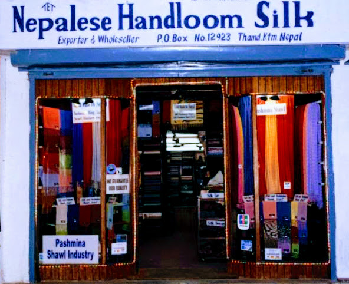



  <h2>Showroom</h2>

  

    
  

  

  

    <h2>Nepalese Handloom Silk</h2>
  

    

  
Nepalese Handloom silk is a manufacturer, exporter and retailer since 1985. Our showroom is at Thamel tourist hub center. The shawls we manufacture are a product of quality consciousness and dedicated workmanship. We employ mostly experienced women for this very intricate art of hand-skill, together with our profound supervision in every step of processing. We are committed to provide full satisfaction to our customers.

  
You will find our products irresistible whether for personal use or for business purpose. It makes a perfect gift for someone you really care for. We have the experience of over 30 years in this field.

  <a href="/showroom">Learn more →</a>

  

  

  



<!-- * Manufacturer & Exporter of Silk, Pashmina Shawl, Stole, Scarf etc.
* Member of Handicraft Association of Nepal -->

