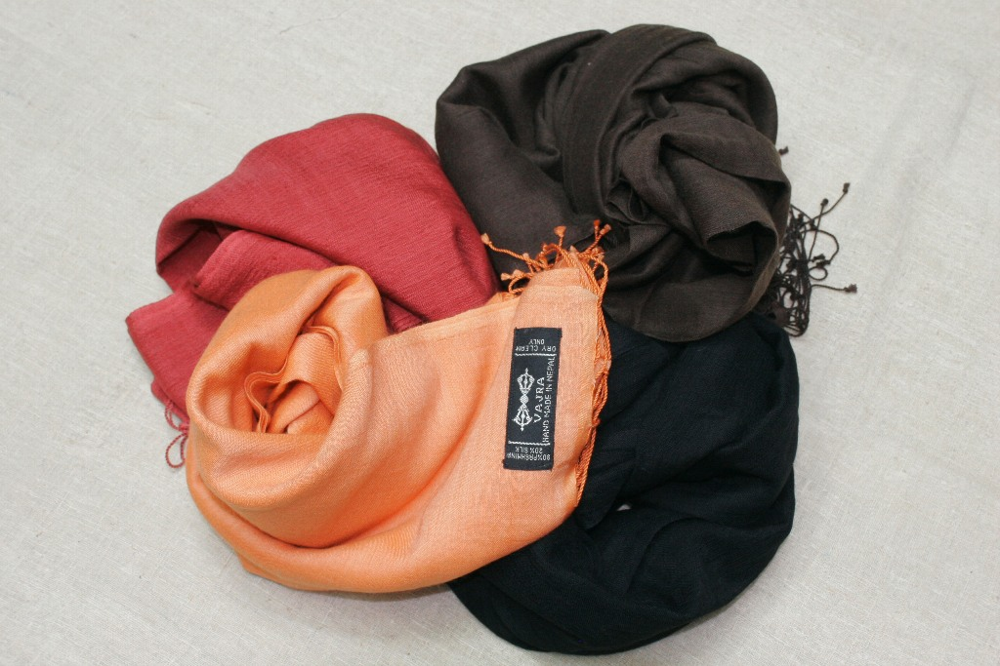
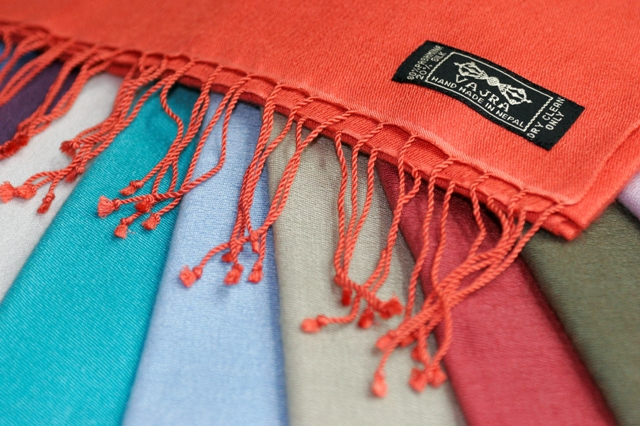
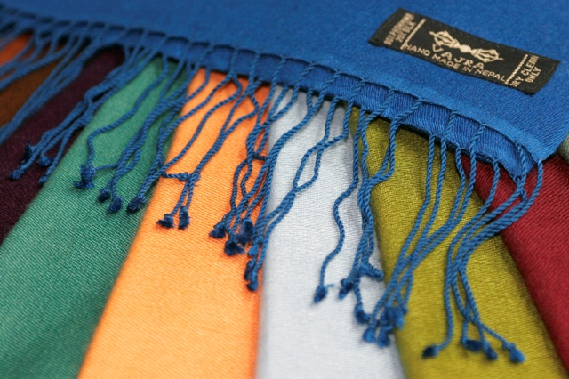
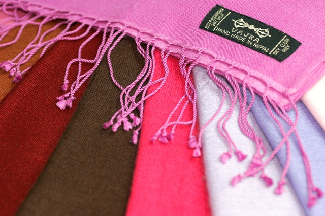
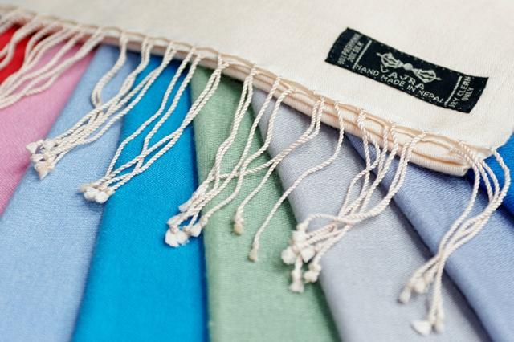
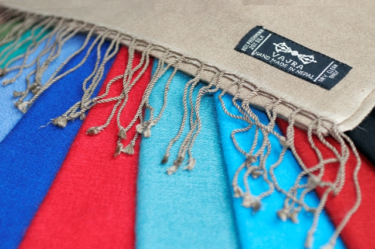

<!-- <h1>Site Products</h1>


<h2>{{ staff_member.name }} - {{ staff_member.position }}</h2>

{{ staff_member.content | markdownify }}

 -->

<!-- 

    

        

            

            

            

            

            

            

            

        

    

 -->

